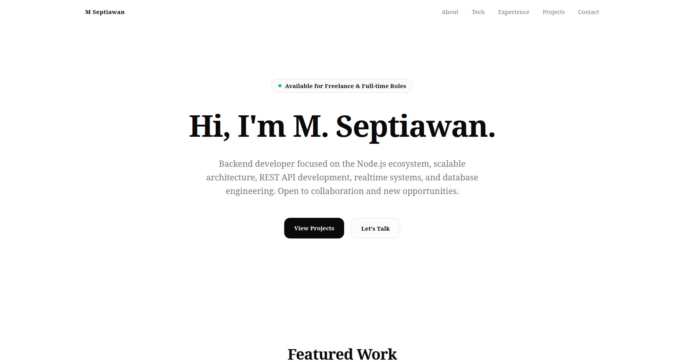
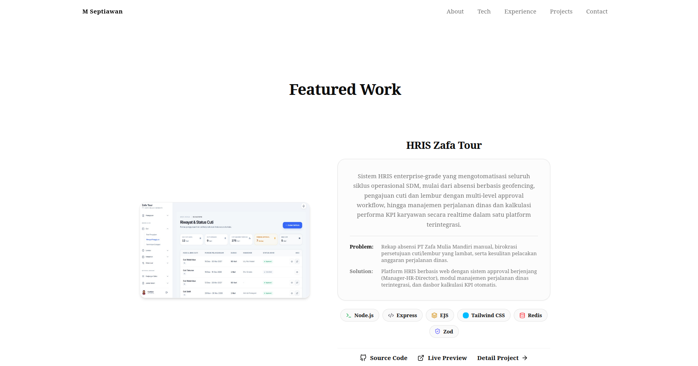

# Personal Portfolio Website

<p align="center">
  
</p>

<p align="center">
  Modern portfolio website built with <strong>Next.js</strong>, showcasing my projects, professional experience, technical skills, and achievements as a Backend Developer.
</p>

---

## Overview

This project is my personal portfolio website, designed to present my software engineering experience, featured projects, and technical expertise in a clean and responsive interface.

The portfolio highlights my work in backend development, REST API design, database architecture, automation systems, and scalable web applications.

---

## Features

- Responsive modern UI
- Dark mode support
- Project showcase
- Technology stack section
- Professional experience timeline
- Achievements & certifications
- Contact section
- SEO friendly
- Fast performance with Next.js App Router

---

## Preview

<p align="center">
  
  

</p>

---

## 🛠 Tech Stack

### Frontend

- Next.js 15
- React
- TypeScript
- Tailwind CSS

### UI

- Lucide React
- Geist Font

### Deployment

- Vercel

---

## Project Structure

```text
app/
components/
public/
docs/
 └── images/
```

---

## Getting Started

Clone this repository.

```bash
git clone https://github.com/mseptiawan/portfolio.git
```

Move into the project directory.

```bash
cd portfolio
```

Install dependencies.

```bash
npm install
```

Run the development server.

```bash
npm run dev
```

Open your browser and visit:

```
http://localhost:3000
```

---

## Build for Production

```bash
npm run build
npm start
```

---

## License

This project is available for learning purposes.

Please do not copy the design or content without permission.

---

## 👨Author

**M. Septiawan**

Backend Developer

- REST API Development
- Node.js Ecosystem
- Database Engineering
- Realtime Applications
- System Architecture

---
